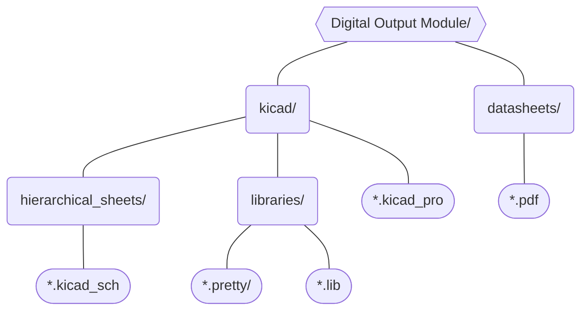

# Digital Output Module
This module will handle the DAQ's NI-9403 Digital I/O. It will contain the relay stages utilize to control the ignition sequence. Any unused pins will be made available in headers or test points for future expandabilty. 

## Directory Structure
