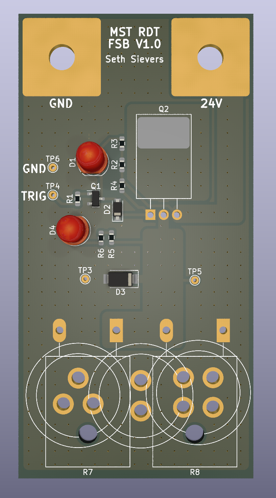

# Fet Stress Test
This board will allow for testing and validation of the output fet stages for the Digital Output Module. This means that if something goes wrong, we would have to redesign a $2.00 board rather than a potentially much more expensive one. This board will also be used to validate that all of the connector footprints are correct, saving us from more potential problems. 

 
 
 

    

<em>PCB Render</em>
