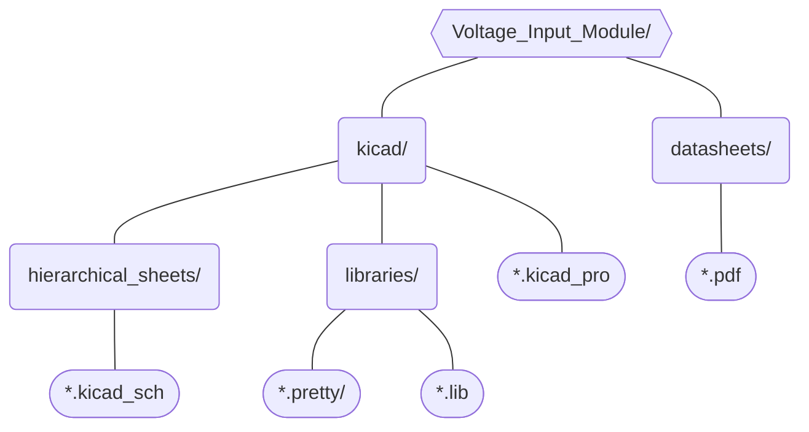

# Voltage Input Module
This module will handle handle the DAQ's NI-9202 Analog Inputs. It will provide power to various sensors and connect signal lines to the appropriate DAQ inputs. Any unused pins will be made available in headers or test points for future expandabilty.

## Directory Structure
